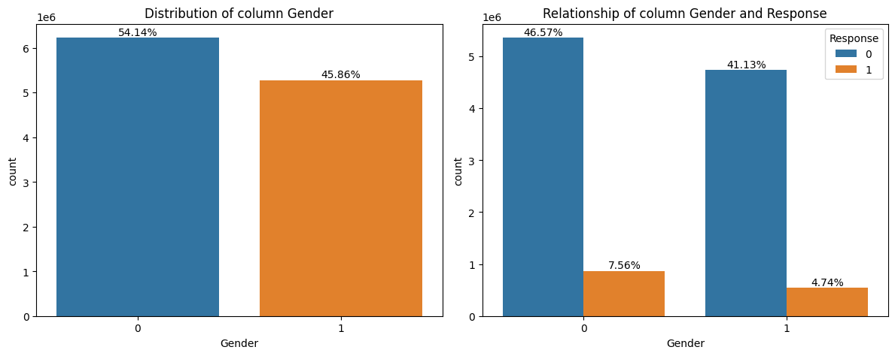
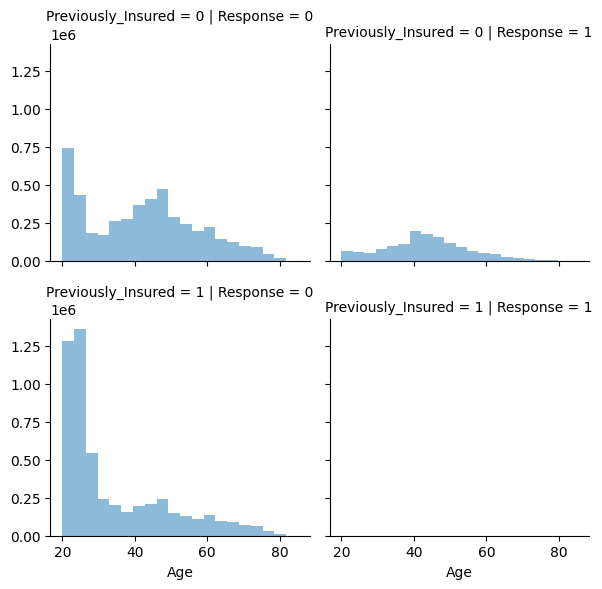
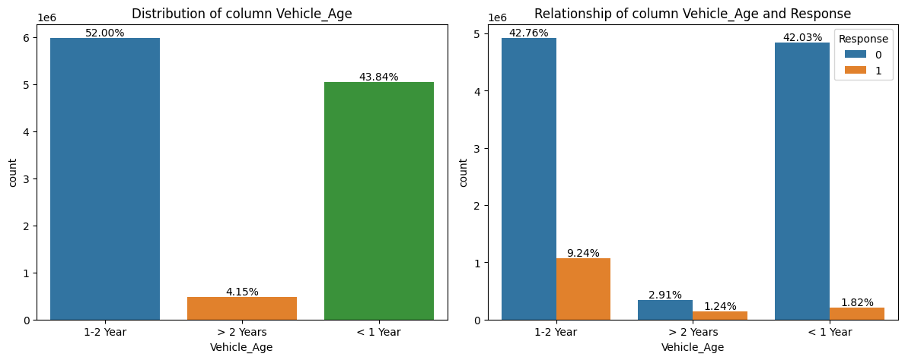

# InsuranceCrossSelling Project


## Overview
The InsuranceCrossSelling project involves training and evaluating machine learning models to predict the likelihood of customers purchasing additional insurance products. The goal is to identify key features that influence cross-selling opportunities and to build models that can effectively predict customer behavior.

## Data
The dataset used in this project includes various customer attributes, such as age, driving license status, region code, vehicle age, vehicle damage, and previous insurance. The dataset is split into training and testing sets for model development and evaluation.

  

## Features
Key features in the dataset include:
- `Age`: Age of the customer
- `Driving_License`: Whether the customer has a driving license (1: Yes, 0: No)
- `Region_Code`: Code representing the customer's region
- `Previously_Insured`: Whether the customer already has vehicle insurance (1: Yes, 0: No)
- `Vehicle_Age`: Age of the customer's vehicle
- `Vehicle_Damage`: Whether the customer's vehicle has been damaged in the past (1: Yes, 0: No)

  

## Models
Two machine learning models were trained using different data sources and feature manipulation techniques: 

1. **Model01**: Logistic Regression trained.
   - **Accuracy**: 0.876657
   - **ROC**: 0.502125

2. **Model02**: Random Forest.
   - **Accuracy**: 0.863838
   - **ROC**: 727700

  


### Leaderboard Scores
- Score: 0.84564


## Results
Both models achieved high accuracy, with Model02 slightly outperforming Model01. Despite the similar leaderboard scores, the difference in training accuracy suggests that feature manipulation in Model02 improved its predictive power.

## Exploratory Data Analysis (EDA)
During EDA, the `Driving_License` feature was examined:
- Majority of customers (99.8%) have a driving license, while a small percentage (0.2%) do not.
- The mean response for customers with a driving license is higher (0.123132) compared to those without (0.055148).

Based on these findings, the `Driving_License` feature was kept for model training due to its relevance in predicting customer response.

## Usage
To replicate or extend this project, follow these steps:

1. **Clone the repository:**
   ```bash
   git clone https://github.com/whoami01001/InsuranceCrossSelling.git
2. **Install the required dependencies:**

  pip install -r requirements.txt
  Run the training scripts to train the models.

Evaluate the models using the provided evaluation scripts.

For further details or questions, please refer to the documentation or open an issue in the repository.

# **Installation and Usage :**

- Clone this repository.
-  the required dependencies listed in requirements.txt.
- Run the training scripts to train the models.
- Evaluate the models using the provided evaluation scripts.
- For more detailed instructions, refer to the documentation or open an issue in the repository.
